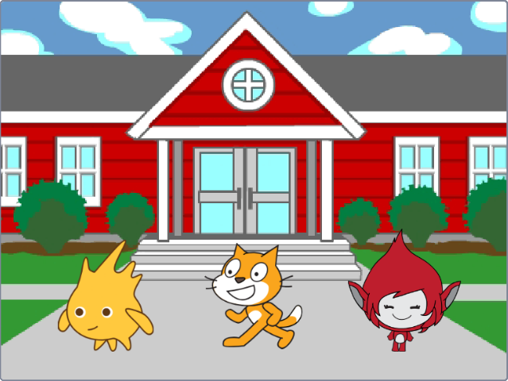
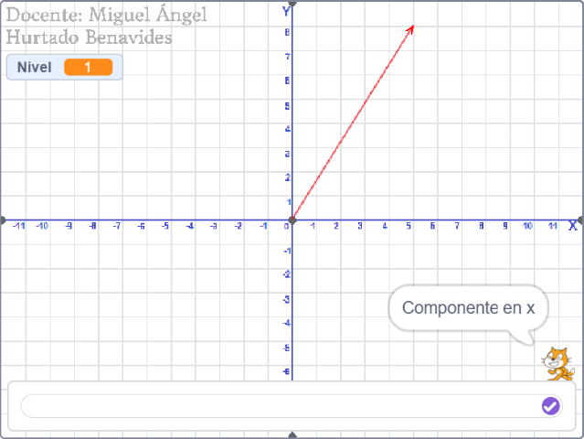
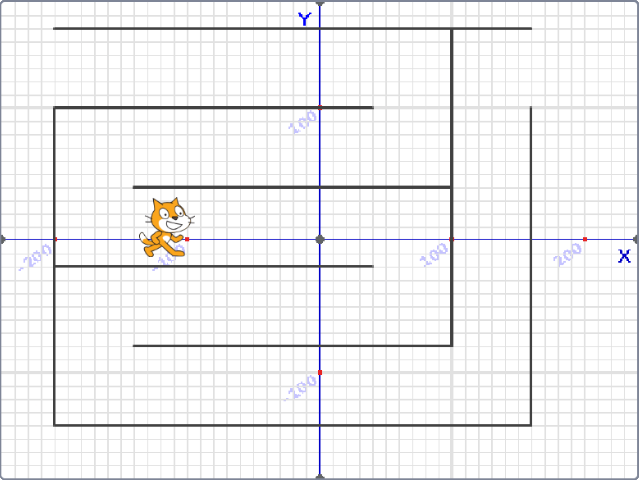
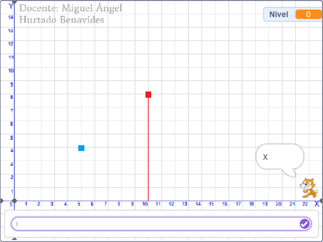
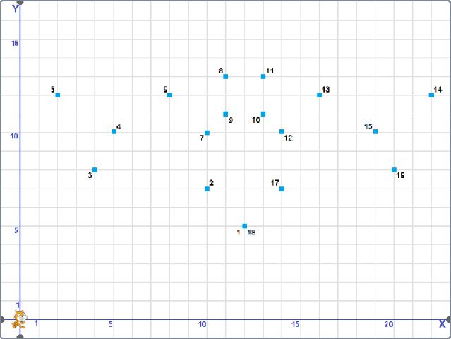

 

<h1 align="center">Proyectos diversos</h1>

Ángel David Hurtado

 

El presente repositorio está formado por mis proyectos académicos como estudiante, esto gracias a todas las personas que han contribuido al desarrollo del hardware y software.

 
 

<h2 align="center">Scratch</h2>

 

### El gato y el ratón - ¡Atrápalo con coordenadas!

	

 

### Tensión

	

 

### Vectores

	

 

### Laberinto

	

 

### Coordenadas

	

 

### Batman

	

 

### Porcipostres - Torta

	

 
 

## [**Ver más...**](https://angeldavidhurtado.github.io)

 
